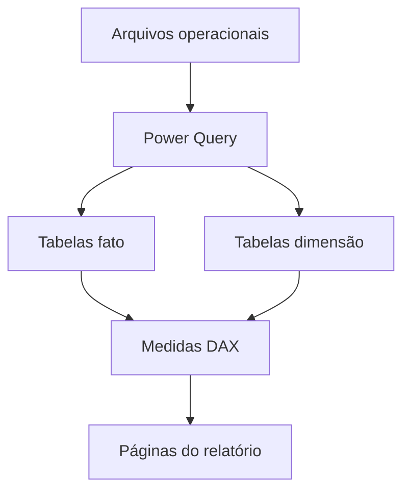

# Arquitetura da solução

## Visão simples

O relatório foi organizado em quatro responsabilidades:

1. **Origem:** arquivos operacionais com lançamentos, orçamento e bases de apoio.
2. **Transformação:** Power Query aplica filtros, renomeações, tipos e correções.
3. **Modelo:** tabelas fato e dimensões recebem relacionamentos.
4. **Consumo:** medidas DAX alimentam páginas executivas e detalhamentos.

O fluxo conecta dimensões e fatos a medidas DAX, mantendo a regra de negócio
separada da camada visual.

## Por que separar as responsabilidades?

Quando a regra de negócio fica espalhada entre consultas, visuais e fórmulas,
uma pequena alteração pode produzir números diferentes em páginas distintas.
Ao centralizar cada responsabilidade, fica mais fácil:

- localizar a origem de um número;
- testar uma transformação;
- reaproveitar uma medida;
- explicar o modelo para outra pessoa;
- trocar a fonte sem redesenhar o relatório inteiro.

## Papel do analista de BI

O trabalho combina três perspectivas:

- **Dados:** garantir que as colunas tenham tipo, chave e granularidade coerentes.
- **Negócio:** transformar perguntas financeiras em regras mensuráveis.
- **Produto analítico:** apresentar o resultado com hierarquia visual e navegação.
