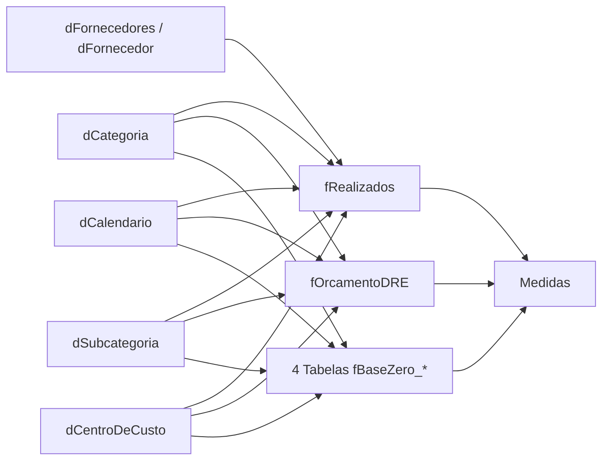

# Modelo semântico e relacionamentos

> **Nó Pai:** [[05_PROJETOS/DRE/Case-Power-BI-DRE-Logistica/README|Voltar ao Case DRE]] | [[05_PROJETOS/DRE/HUB_DRE|HUB DRE]]  

## Como ler o modelo

O modelo combina tabelas de movimentação e orçamento com dimensões usadas para
filtrar a análise. Em linguagem simples:

- **Fato** guarda eventos ou valores que podem ser somados.
- **Dimensão** descreve os eventos e cria filtros reutilizáveis.
- **Medida** calcula um resultado no contexto selecionado.
- **Relacionamento** conecta a dimensão à tabela que será filtrada.

## Grupos de tabelas

| Grupo | Papel no relatório |
| --- | --- |
| Lançamentos | Registra valores realizados e atributos da movimentação |
| Orçamento DRE | Guarda a referência orçada da estrutura do DRE |
| Bases de planejamento | Organiza componentes usados no orçamento base zero |
| Calendário | Filtra por dia, mês e período |
| Categoria e subcategoria | Organizam a hierarquia financeira |
| Centro de custo | Permite localizar onde o valor foi apropriado |
| Fornecedor | Permite detalhar a origem do lançamento |
| Medidas | Centraliza os cálculos consumidos pelas páginas |

## Relacionamentos principais

## Direção dos filtros

O caminho preferencial é dimensão → fato. Assim, selecionar um mês ou uma
categoria reduz os registros das tabelas de movimentação sem duplicar filtros
em cada visual.

Algumas relações auxiliares podem usar filtro bidirecional quando o relatório
precisa sincronizar uma tabela de apoio com a seleção atual. Esse recurso deve
ser usado com cuidado, pois pode criar caminhos ambíguos ou resultados difíceis
de explicar.

## Granularidade

Cada fato precisa ter uma linha representando uma unidade de análise clara:
um lançamento, uma linha orçada ou uma composição de planejamento. As dimensões
devem ter chaves suficientemente estáveis para não multiplicar valores quando
o relacionamento for aplicado.

## Boas práticas aplicadas

- usar uma dimensão calendário compartilhada;
- centralizar medidas em uma tabela própria;
- relacionar fatos por chaves de negócio tratadas;
- evitar lógica financeira repetida em visuais;
- documentar exceções de filtro bidirecional.

