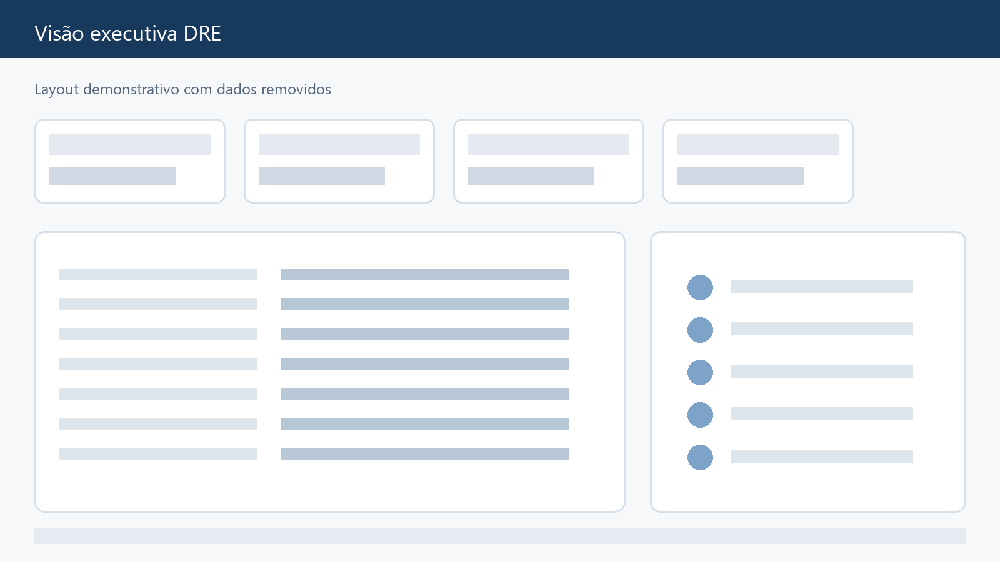
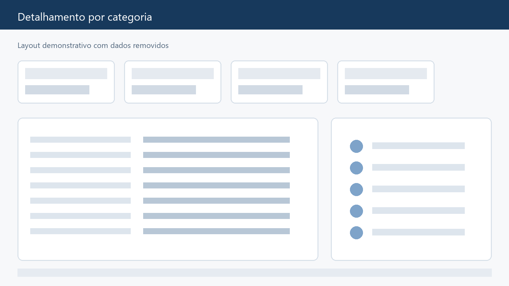

# Páginas do relatório

> **Nó Pai:** [[05_PROJETOS/DRE/Case-Power-BI-DRE-Logistica/README|Voltar ao Case DRE]] | [[05_PROJETOS/DRE/HUB_DRE|HUB DRE]]  

## Visão principal

A página principal concentra os indicadores do DRE e permite que o usuário
comece pela leitura executiva. A hierarquia recomendada é:

1. período e filtros;
2. total realizado e orçamento;
3. variações;
4. composição por categoria;
5. caminho para o detalhe.

## Detalhamento por categoria

A página de detalhamento recebe o contexto selecionado na visão principal e
permite investigar a origem de uma variação. O recurso de drillthrough evita
sobrecarregar a página executiva com todas as colunas operacionais.

## Página técnica

Uma página de apoio pode permanecer oculta no modo de visualização quando serve
para validar bases, apoiar manutenção ou receber tabelas auxiliares. Ela não é
uma página de consumo executivo.

## Experiência de uso

- começar com poucos indicadores;
- permitir filtro por período e hierarquia financeira;
- manter nomes consistentes entre visuais;
- usar drillthrough para aprofundar;
- mostrar a data de atualização de forma clara;
- não depender de uma legenda que o usuário precise memorizar.

